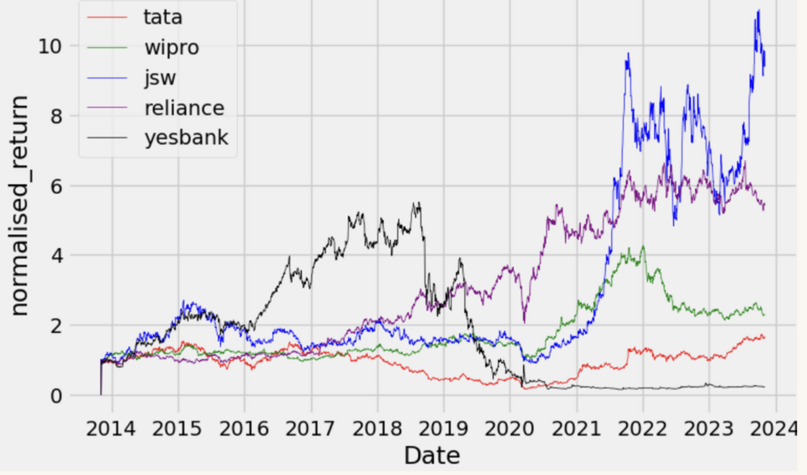
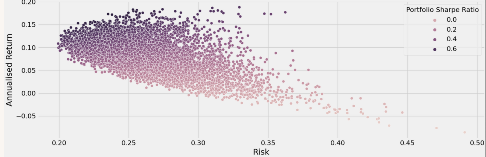

# Monte Carlo Portfolio Simulation

This repository contains a simple Monte Carlo–based portfolio simulation that explores the risk–return trade-off for a small equity portfolio using daily price data.
| **Share Price Plot** | **Monte Carlo Simulation** |
|----------------------|----------------------------|
|  |  |


The example portfolio uses five Indian stocks: **Tata**, **Wipro**, **Yes Bank**, **Reliance**, and **JSW**. The goal is to estimate portfolio return, volatility, and Sharpe ratio for many randomly generated portfolios and highlight the portfolios with:

- Maximum Sharpe ratio (best risk-adjusted return)
- Minimum volatility (lowest risk)

---

## 1. Methodology

1. **Data**
   - Daily closing prices are loaded for each stock over a multi-year horizon.
   - Daily returns are computed using `pct_change()`.

2. **Portfolio Simulation**
   - For each simulation:
     - Random portfolio weights are generated with `np.random.random()` and normalized to sum to 1.
     - Normalized returns and weights are used to compute:
       - Expected annualized return  
       - Annualized volatility (standard deviation of portfolio returns)  
       - Sharpe ratio (risk-adjusted return; risk-free rate assumed 0 in this basic version)

3. **Monte Carlo Loop**
   - The process above is repeated for **thousands of iterations** (e.g. 7,000).
   - For each simulated portfolio, risk, return, and Sharpe ratio are stored.

4. **Analysis & Visualisation**
   - Scatter plot of **risk (volatility)** vs **annualized return**, coloured by Sharpe ratio.
   - Extraction of:
     - Portfolio with **maximum Sharpe ratio**
     - Portfolio with **minimum volatility**

---

## 2. Repository Structure

> Adjust names if you change file paths in the repo.

- `TA_MACD_Agam.ipynb` – main Jupyter notebook with the full Monte Carlo simulation and plots.
- `TA_Agam_MACD.pdf` – short presentation deck explaining the intuition, methodology, and insights.

You can easily adapt the notebook to:
- Change the list of stocks
- Modify the number of simulations
- Plug in a non-zero risk-free rate
- Extend to other markets or asset classes

---

## 3. Getting Started

### Prerequisites

- Python 3.8+
- Jupyter Notebook / JupyterLab
- Recommended libraries:
  - `numpy`
  - `pandas`
  - `matplotlib`
  - `yfinance` (or any other data source you prefer)

Install typical requirements via:

```bash
pip install numpy pandas matplotlib yfinance
